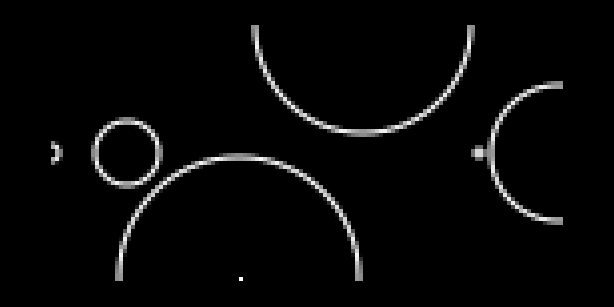

# Circles

Circles consists of `lib/libCircles.lua`, the sequencing engine and the `circles.lua` script that uses the engine.

## circles.lua

The circles script allows you to move a cursor around on screen using _ENC 2_ and _ENC 3_. Pressing _KEY 3_ will place a new circle at the cursor point. _KEY 2_ will remove the circle at the cursor point. Holding _KEY 1_ will remove all circles after a confirmation step. _ENC 1_ adjusts the cutoff frequency of the filter.

Placed circles will grow with each MIDI tick. This means that it will stay in beat with whatever else you have going on.

Circles will burst when they hit another circle or when the get _too big_. When they burst, they make sound. The sound they make depends on their _x_, _y_ position on the screen and how big they are when they burst.

The pitch is determined by their _x_ coordinate, with lower pitches on the left and higher pitches on the right.

The timbre is determined by their _y_ coordinate, currently connected to PWM of the PolyPerc engine.

The size determines how long the sound will last. Larger circles will sound out for longer.

There are also a few parameters to adjust under the _KEY 1_ parameters page. Play around with those.

### v1.6

This is a pretty major update under the hood. Because of that I took this as an opportunity to update some of the param IDs. This means that existing PSETs will probably result in unexpected behavior.

**Before updating, if you have any saved PSETs that you rely on, I'd encourage you to write down the settings so you can recreate them after updating.**

- Finally switched from using the old-school `beatclock` to the new hotness, `clock`.
- Added midi-in transport controls; circles will now start/stop when the midi leader starts and stops.
- MIDI out device shows name in params menu
- Updated order of `outputs` param list; This will probably cause issues with any existing PSETs
- Cleaned up params menu by grouping some params
- Added new "step division" param

### v1.5

- Added MIDI support. Choose midi device (1 - 4) and channel (1 - 16) in params.
- Added scale selection. Choose root note and mode in params.

### v1.4

- Added Crow + Just Friends support. Please make sure to update your crow and Norns to the latest firmware.

### v1.3

- Circles now supports the system saving/loading of params. See the PARAMETERS section of https://monome.org/docs/norns/ for more information.

### v1.2

- Added deterministic burst type option. This should allow for more loop like rhythms.

### v1.1

- Added crow support.

- Added params for output; audio or crow. If crow:
     - Output 1: Trigger
     - Output 2: Pitch
     - Output 3: Y Pos  (0 - 10V)
     - Output 4: Radius (0 - 10V)
 
- Added params for clock; midi or crow. Crow accepts clock on input 2. I would like this to be on input 1, but there is currently a bug with norns or crow mentioned here (https://llllllll.co/t/crow-help-norns/25863/10).

## lib/libCircles.lua

This is the library that does all of the heavy lifting. It keeps track of all of the circles, grows them and does the hit detection to decide when to burst them. It can communicate with a client script by way of callback functions. If you're interested in any of this, please read the documentation in the file.
